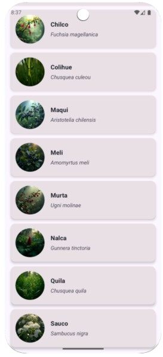
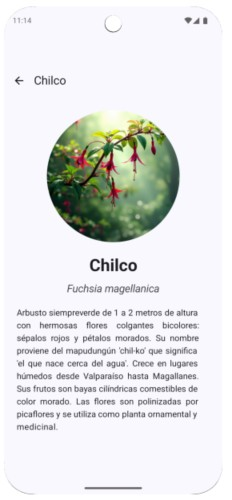
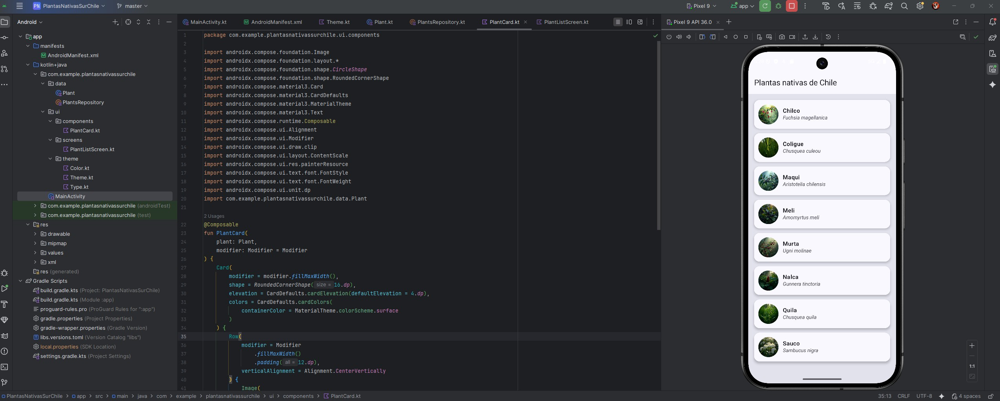
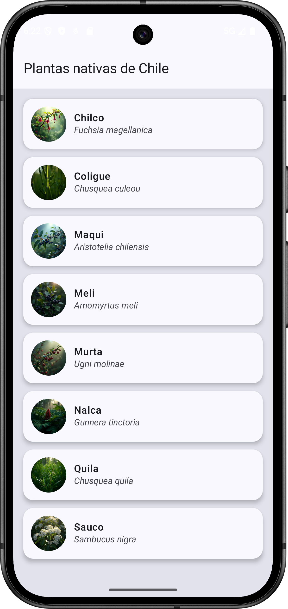

**_<h1 align="center">:vulcan_salute: Proyecto Realizado con Andoid Studio dividido en dos etapas :computer:</h1>_**

**<h3>:blue_book: Objetivo Actividad ABP_AE2 - Implementación de LazyColumn - Flora Nativa de Chile:</h3>**

<p>Crear una aplicación Android con Jetpack Compose que muestre una lista de plantas nativas chilenas utilizando LazyColumn:</p>



**<h3>:orange_book: Características de la Implementación:</h3>**

✅ LazyColumn para renderizado eficiente
✅ Cards con diseño Material 3
✅ Imágenes circulares de las plantas
✅ Nombres científicos en cursiva

<hr style="border: none; height: 2px; background-color: blue; width: 80%;">

**<h3>:blue_book: Objetivo Actividad ABPRO_AE2 - Navegación en Compose (Type-Safe con Kotlin Serialization):</h3>**

<p>Crear una aplicación Android con Jetpack Compose del tipo Master/Detail.</p>
<p>Es una expansión del trabajo individual anterior. Se debe implementar una segunda pantalla para mostrar el detalle de cada especie al clicar en la tarjeta correspondiente.</p>



**<h3>:orange_book: Características de la Implementación:</h3>**

✅ Pantalla de detalle muestra una descripción de la especie
✅ Avatar y nombre de la especie ampliados
✅ Botón para volver a la pantalla principal

<hr style="border: none; height: 2px; background-color: blue; width: 80%;">

<!-- **<h3>:book: Link a video en Youtube que muestra proyecto ejecutado:</h3>** -->

<!-- <p align="center">
  <a href="https://www.youtube.com/watch?v=6VQe9vkByBM" target="_blank" style="display:inline-block; padding:10px 20px; background:#ff0000; color:white; border-radius:8px; text-decoration:none; font-weight:bold;">
    ▶️ Ver en YouTube
  </a>
</p> -->

**<h3>📁 Estructura del Proyecto Android:</h3>**

```Android
📘 README.md
📁 app/src/main/
├── 🟧 AndroidManifest.xml
├── 📁 java
│   ├── 📁 com.example.plantasnativassurchile
│   │   ├── 📁 ui
│   │   │   └── 📁 theme
│   │   │    ├── 🟦 MainActivity.java
│   │   │    ├── 🟦 MainActivity.java
│   │   │    └── 🟦 MainActivity.java
|   |   ├── 🟦 MainActivity.java
│   │   └── 🟦 MainActivity.java
│   ├── 📁 com.example.plantasnativassurchile (android Test)
│   │   └── 🟦 ExampleInstrumentedTest.java
│   └── 📁 com.example.plantasnativassurchile (test)
│       └── 🟦 ExampleUnitTest.java
├── 📁 java (generated)
├── 📁 res
│   ├── 📁 drawable
│   │   ├── 🖼️ app_plantas_nativas_abp_1.png
│   │   ├── 🖼️ app_plantas_nativas_abp_2.jpg
│   │   ├── 🖼️ world.jpg
│   │   ├── 🟧 ic_launcher_background.xml
│   │   └── 🟧 ic_launcher_foreground.xml
│   ├── 📁 layout
│   │   └── 🟧 activity_main.xml
│   ├── 📁 mipmap
│   │   ├── 📁 ic_launcher
│   │   └── 📁 ic_launcher_round
│   ├── 📁 values
│   │   ├── 📁themes
│   │   │   ├── 🟧 themes.xml
│   │   │   └── 🟧 themes.xml (night)
│   │   ├── 🟧 colors.xml
│   │   └── 🟧 strings.xml
│   └── 📁 xml
📁 Gradle Scripts
├── 🟦 build.gradle.kts (Project: PlantasNativasSurChile)
├── 🟦 build.gradle.kts (Module: app)
├── 🟦 proguard-rules.pro (ProGuard rules for ":app")
├── 🟦 gradle.properties (Project properties)
├── 🟦 gradle-wrapper.properties (Gradle Version)
├── 🟦 libs.versions.toml (version Catalog "libs")
├── 🟦 local.properties (SDK Location)
└── 🟦 settings.gradle.kts (Project Settings)
```

**<h3>:book: Imagen general del proyecto Etapa 1 (ABP AE2):</h3>**



**<h3>:book: Capturas de pantalla de la interfaz de usuario final Etapa 1 (ABP AE2):</h3>**



**<h3>:book: Imagen general del proyecto Etapa 2 (ABPRO AE2):</h3>**


**<h3>:book: Capturas de pantalla de la interfaz de usuario final Etapa 2 (ABPRO AE2):</h3>**


